# Vigilia — *always on watch*

Supervision réseau **en lecture seule** pour switches **Alcatel-Lucent Enterprise OmniSwitch (AOS 8)**.
Vigilia interroge vos switches en SSH, présente leur état sur **une seule page, sans défilement**, détecte les
problèmes, explique leur cause probable, garde l'historique et sauvegarde les configurations. Il n'envoie
**aucune commande de configuration** aux équipements.

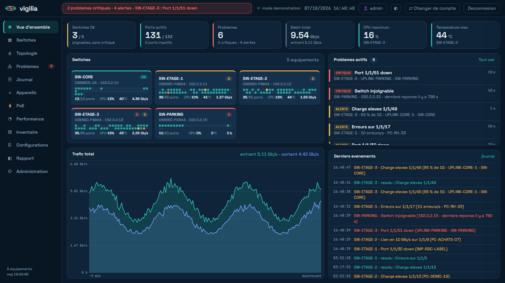

> Toutes les captures de ce dépôt proviennent du **mode démonstration** (réseau fictif, adresses `192.0.2.x`
> réservées à la documentation). Aucune donnée réelle n'est présente dans ce dépôt.

## Fonctionnalités

| | |
|---|---|
| **Vue d'ensemble** | Compteurs globaux, une carte par switch, problèmes actifs, derniers événements, trafic total |
| **Switches** | Façade du switch (ports colorés par état), trafic, CPU, température ; clic sur un port : MAC connectées, VLAN, PoE, voisin LLDP, erreurs, compteurs |
| **Topologie interactive** | Switches → catégories d'appareils (Wi-Fi, téléphones, serveurs, pare-feu…) → appareils ; zoom, déplacement, recherche, filtres, panneau de détails |
| **Problèmes** | Alertes triées par gravité, cause probable, commandes de vérification, aide à la connexion SSH |
| **Journal détaillé** | Filtres (niveau, switch, type, période, texte), détail d'un événement (contexte, événements liés), **export `.zip` compressé** |
| **Appareils** | Toutes les MAC vues, constructeur, première vue, déplacements ; **filtres** (switch, VLAN, constructeur, type, vitesse, PoE, nouveaux, déplacés, problèmes) et tri par colonne |
| **PoE · Performance · Inventaire** | Consommation PoE ; courbes live et historiques (1 h à 30 j) ; modèles, firmwares, numéros de série (export CSV) |
| **Configurations** | Sauvegarde quotidienne, historique, comparaison entre versions, téléchargement `.txt`, copie dans le presse-papiers |
| **Rapport** | Incidents, durée moyenne de résolution, disponibilité, ports instables (imprimable en PDF) |
| **Comptes & sécurité** | Rôles (lecture / technicien / admin), création de comptes, double authentification TOTP, journal d'audit |
| **Confort** | Thème sombre ou clair, adapté au téléphone, changement de compte en un clic |

<table>
<tr>
<td>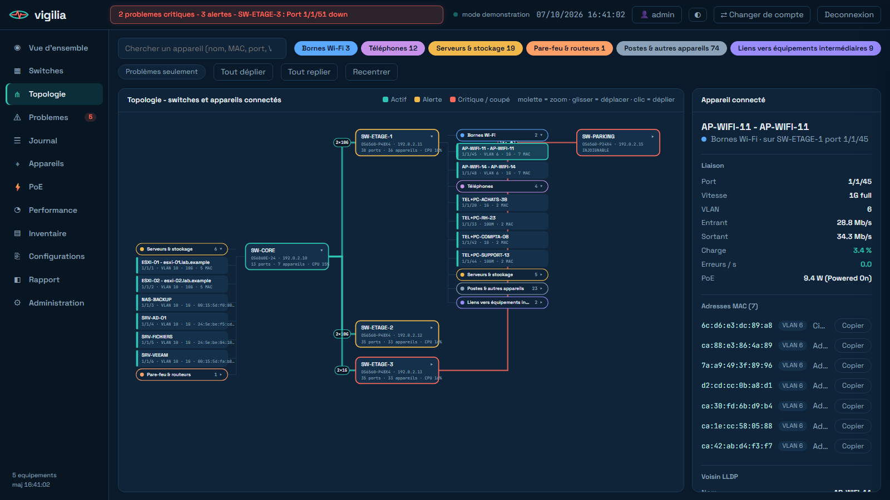<br><sub>Topologie interactive</sub></td>
<td>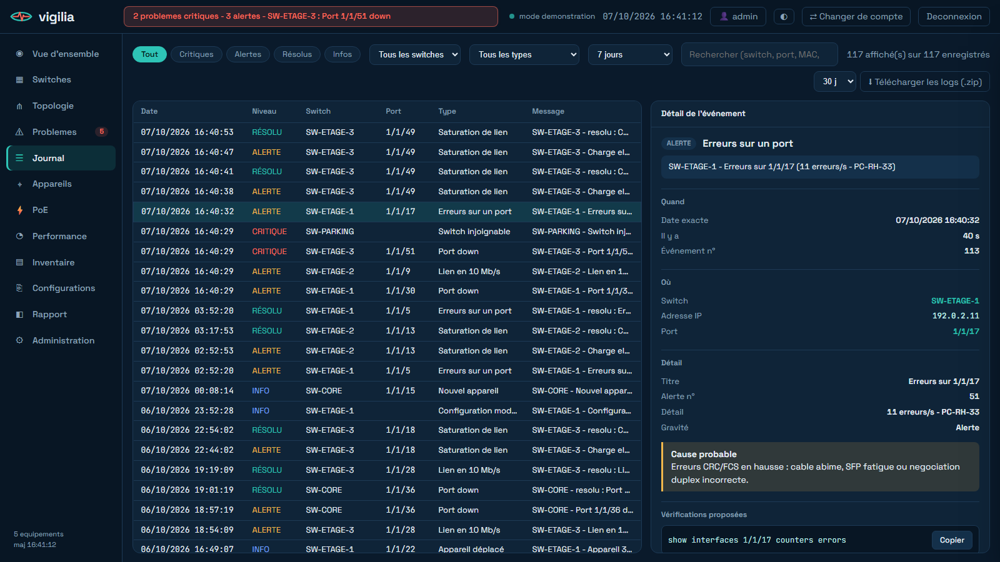<br><sub>Journal détaillé et export zip</sub></td>
</tr>
<tr>
<td>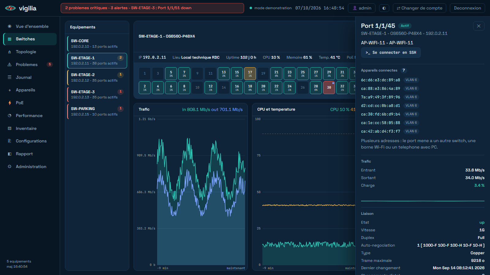<br><sub>Façade du switch et détail d'un port</sub></td>
<td>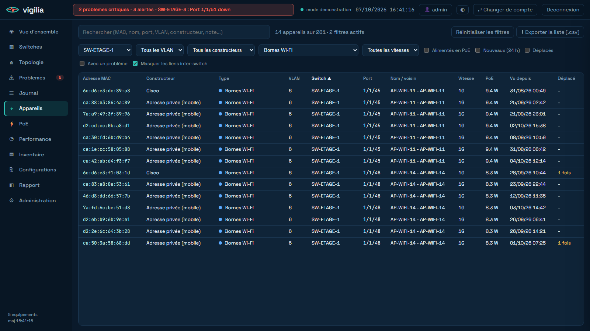<br><sub>Appareils : recherche et filtres</sub></td>
</tr>
<tr>
<td>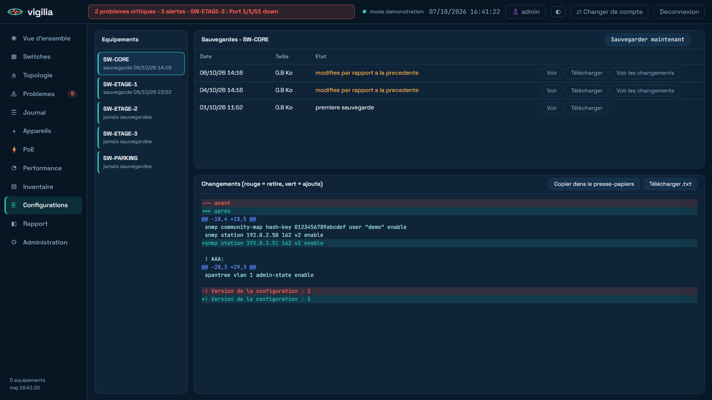<br><sub>Configurations : changements entre versions</sub></td>
<td>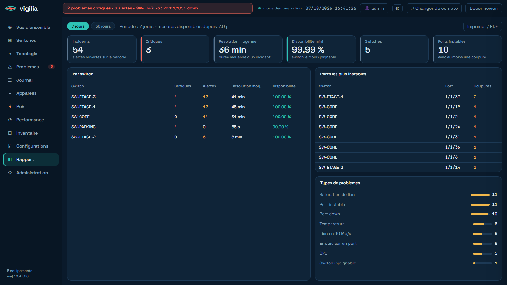<br><sub>Rapport d'incidents</sub></td>
</tr>
<tr>
<td>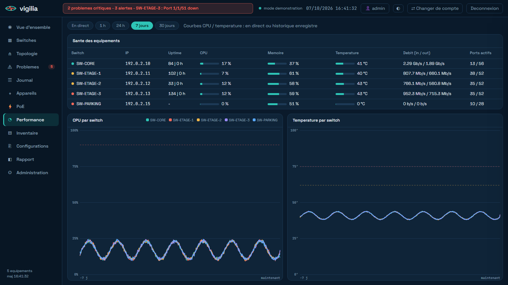<br><sub>Performance (historique 7 jours)</sub></td>
<td>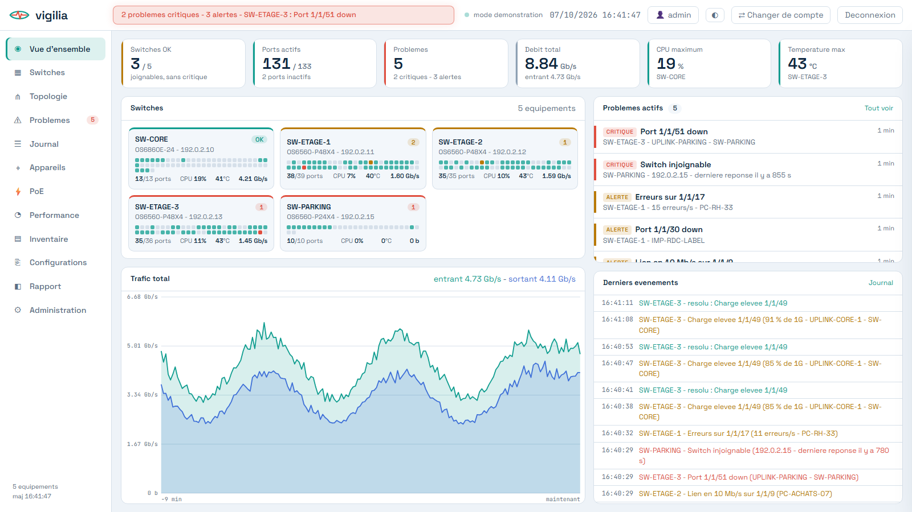<br><sub>Thème clair</sub></td>
</tr>
<tr>
<td>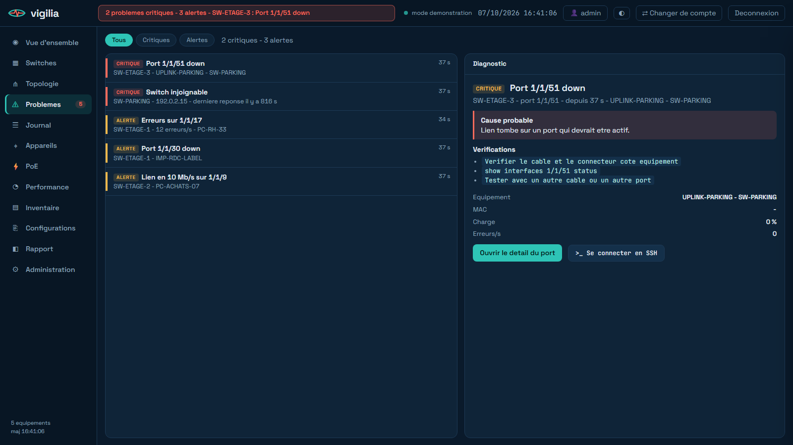<br><sub>Problèmes et diagnostic</sub></td>
<td>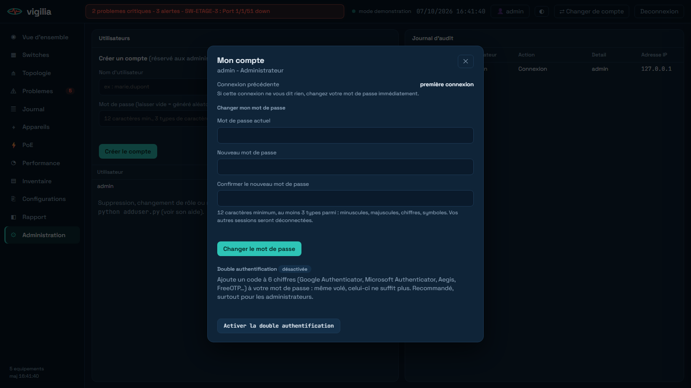<br><sub>Mon compte : mot de passe et double authentification</sub></td>
</tr>
</table>

Autres écrans : [connexion](docs/screenshots/01-connexion.png) · [inventaire](docs/screenshots/11-inventaire.png) ·
[administration](docs/screenshots/12-administration.png) · [téléphone](docs/screenshots/15-mobile.png)

## Démarrage rapide (mode démonstration)

Prérequis : Python 3.11+ (testé en 3.13).

```bash
git clone https://github.com/<votre-compte>/vigilia.git
cd vigilia
pip install -r requirements.txt
python server.py
```

Au premier lancement, le compte `admin` est créé avec un **mot de passe aléatoire affiché une seule fois** dans la
console. Ouvrez ensuite <http://127.0.0.1:8090/>. Le mode démonstration simule un réseau complet (5 switches, appareils,
alertes, historique sur 7 jours, configurations) sans toucher à votre réseau.

Avec Docker : `docker compose up --build` (démonstration uniquement, HTTP sur la machine locale).

## Supervision réelle

```bash
export SW_USER=vigiliaro            # compte SSH des switches (idéalement en lecture seule)
export SW_PASS='...'                # ou --pass-file / identifiant systemd (recommandé en production)
python server.py --live --hosts 192.0.2.10,192.0.2.11-14
```

En production (Debian/Ubuntu, HTTPS, service systemd durci, pare-feu) : voir **[docs/INSTALLATION.md](docs/INSTALLATION.md)**
ou lancez `sudo ./deploy/install.sh --hosts "..." --switch-user vigiliaro --san "IP:...,DNS:..."`.

## Configuration

| Option / variable | Rôle |
|---|---|
| `--live` | Supervision réelle en SSH (sans cette option : démonstration) |
| `--hosts` / `SW_HOSTS` | Switches : adresses séparées par des virgules, plages `a.b.c.X-Y` acceptées |
| `SW_USER` | Compte SSH des switches (défaut `admin`) |
| `SW_PASS`, `--pass-file`, identifiant systemd `sw_pass` | Mot de passe SSH des switches (voir ordre de priorité dans la doc) |
| `--host`, `--port` | Adresse et port d'écoute (défaut `127.0.0.1:8090`) |
| `--cert`, `--key` | Active HTTPS (obligatoire pour écouter hors de la machine locale) |
| `--allow-http` | Autorise l'écoute réseau sans HTTPS (déconseillé) |
| `VIGILIA_DATA` | Dossier des données (base, comptes, sauvegardes, empreintes SSH) |

## Comptes et rôles

| Droit | viewer | tech | admin |
|---|:-:|:-:|:-:|
| Consulter tous les écrans, changer son mot de passe | ✔ | ✔ | ✔ |
| Notes, sauvegarde de configuration, export des journaux, aide SSH | | ✔ | ✔ |
| Voir les configurations (secrets masqués) | | ✔ | ✔ |
| Voir les secrets des configurations, créer des comptes, journal d'audit | | | ✔ |

Gestion en ligne de commande : `python adduser.py <nom> <viewer|tech|admin> [--random]`, `--list`, `--delete`, `--reset-totp`.

## Sécurité

Vigilia a fait l'objet d'une revue de sécurité complète (voir **[SECURITY.md](SECURITY.md)**) : mots de passe PBKDF2 600 000
itérations, double authentification TOTP, sessions à expiration, protection CSRF, limitation de débit, empreintes SSH
épinglées, secrets masqués, service systemd durci, 96 tests automatisés. Signalez toute faille de façon privée
(voir SECURITY.md) plutôt que dans une issue publique.

## Tests

```bash
python tests/test_vigilia.py
```

La suite (96 contrôles) démarre un serveur local temporaire : authentification, en-têtes, CSRF, rôles, création de comptes,
journal, export, double authentification, mode démonstration, force brute, saturation. Aucun switch ni réseau requis.

## Structure du dépôt

```
server.py        serveur HTTP(S), sessions, droits, routes de l'API
live.py          collecte SSH, alertes, historique, configurations, journal, export
demo.py          mode démonstration (réseau fictif)
auth.py          comptes, hachage, politique de mots de passe, TOTP, masquage des secrets
db.py            base SQLite (événements, mesures, appareils, configurations, notes, audit)
hints.py         causes probables et vérifications par type de problème
adduser.py       gestion des comptes en ligne de commande
web/             interface (HTML, JS, CSS, polices locales)
deploy/          service systemd, pare-feu, durcissement SSH, script d'installation
docs/            installation, utilisation, architecture, captures d'écran
tests/           suite de tests
```

## Limites connues

- Conçu et testé pour les OmniSwitch **AOS 8** (commandes `show ...` d'affichage uniquement) ; d'autres équipements demanderaient d'adapter `live.py`.
- Serveur HTTP de la bibliothèque standard Python : à réserver à un réseau interne (voir SECURITY.md pour placer un reverse proxy).
- Pas d'annuaire (LDAP/SSO) : comptes locaux avec double authentification optionnelle.
- Alertes proactives (e-mail, Teams) non encore disponibles.

## Licence

À définir par le propriétaire du dépôt (aucune licence n'est fournie pour le moment : tous droits réservés).

Polices : [Space Grotesk](https://fonts.google.com/specimen/Space+Grotesk) et
[JetBrains Mono](https://www.jetbrains.com/lp/mono/), sous licence SIL Open Font License 1.1 (voir `web/fonts/LICENSES.md`).
